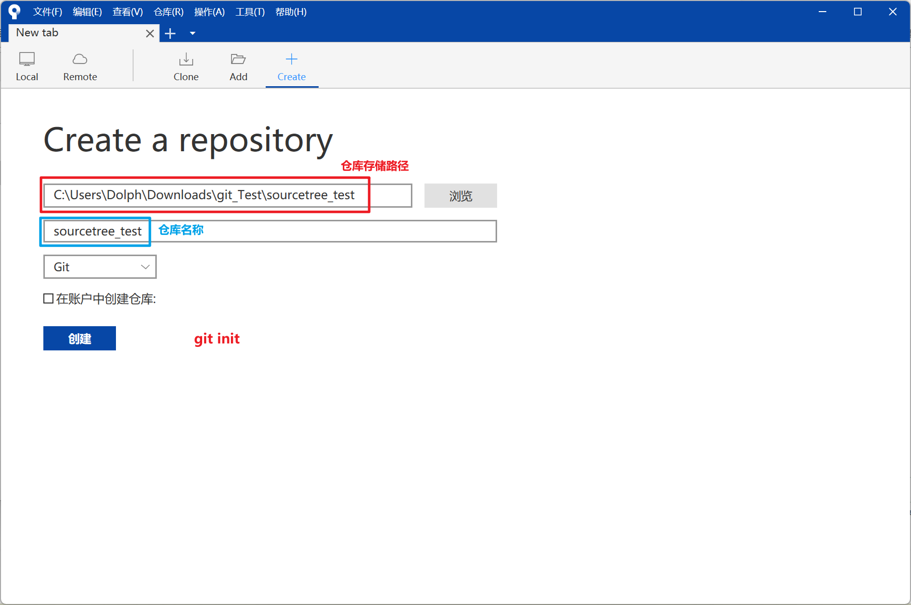
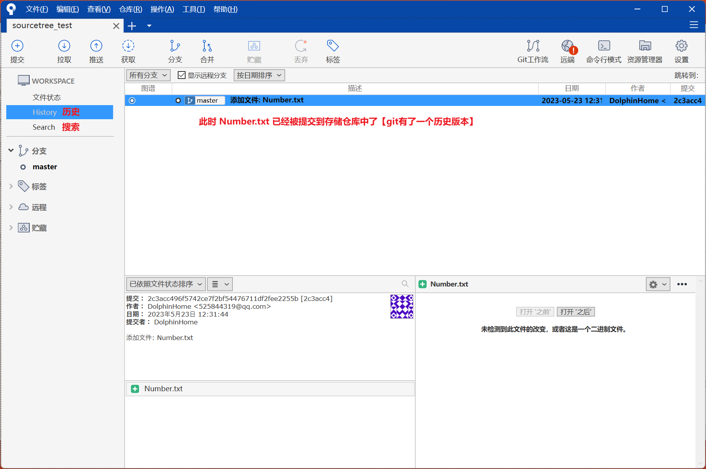
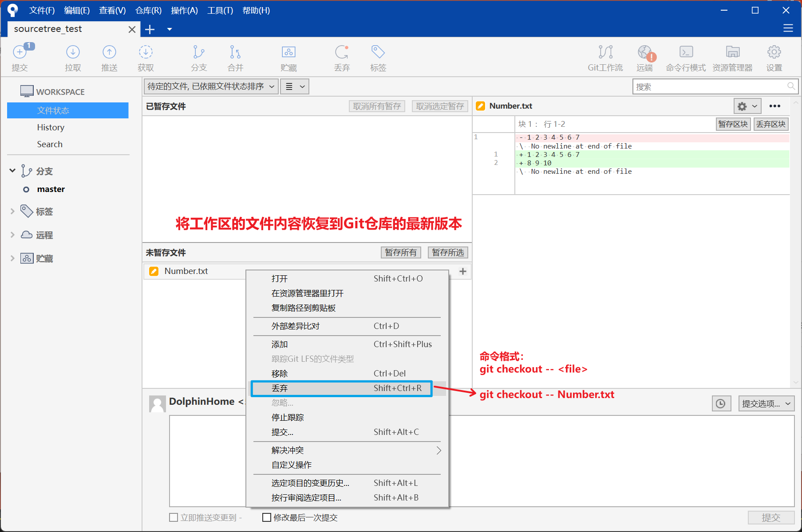
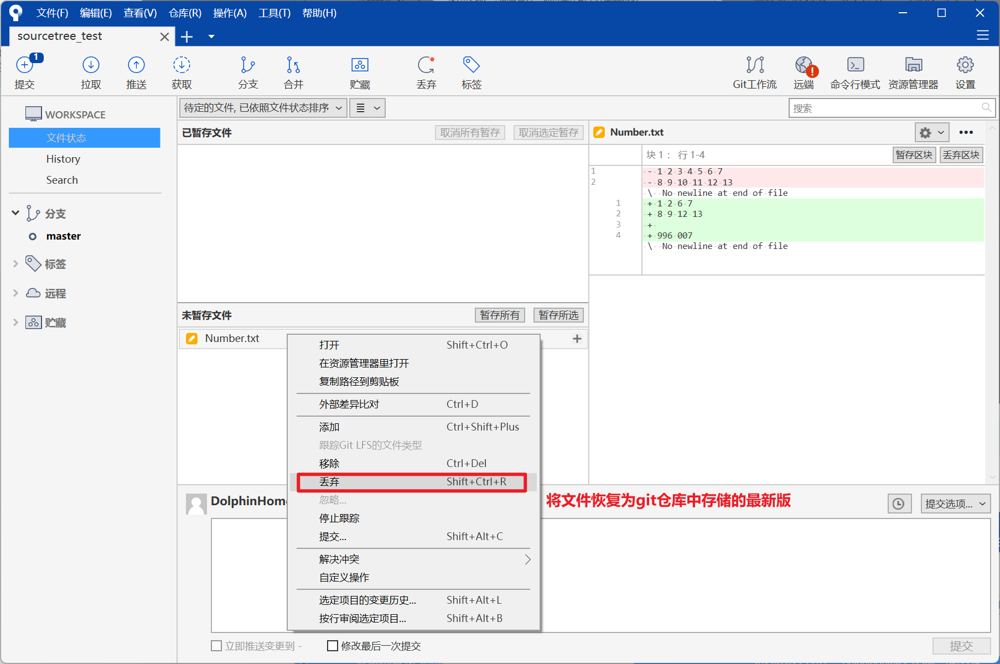
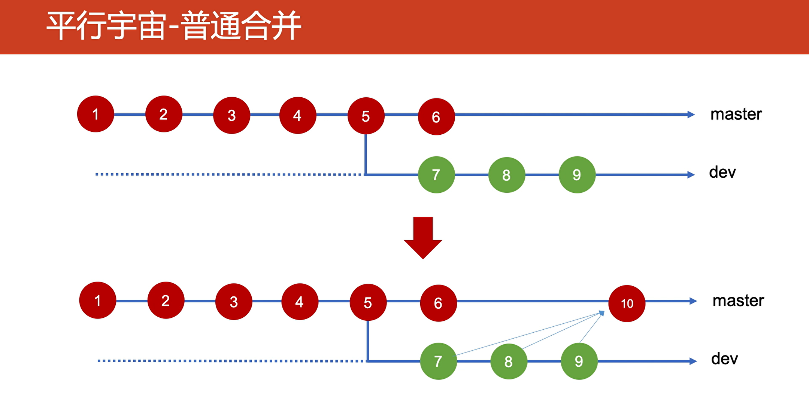

# 环境

> 系统: `Win11 x64`
>
> Git:`2.40.1.windows.1`
>
> SourceTree: `3.4.11`


## 文件的状态


> <span style="color:#b18419;font-weight:bold;">已修改:  文件内容已经被修改</span>
>
> <span style="color:#c20000;font-weight:bold;">已删除  文件本身已经被删除</span>
>
> <span style="color:#722b07;font-weight:bold;">变更:  文件本身没有修改，但是改变了存放位置</span>
>
> <span style="color:#2666b1;font-weight:bold;">未管理:  尚未添加到版本管理的文件，比如新添加的文件</span>
>
> <span style="color:#000000;font-weight:bold;">忽略:  不需要添加到版本管理的文件</span>
>
> <span style="color:#989898;font-weight:bold;">冲突:  以后再详细介绍</span>


### git commit 语义化提交日志

- **每次提交都需要携带`chore`( 维护 )、`docs`( 文档 )、`feat`( 新功能 )、`fix`( bug修复 )、`refactor`( 重构 )、`style`( 样式 )、`test`( 测试 ) 其中一个，不可多个重复在一个commit、中！**


### 语义化版本号

以 `v1.5.2` 为例，1.5.2 按照英文句号分割为三部分: 

- **主版本号**：是你对项目做了不兼容的API修改，即大版本的升级。
- **次版本号**：当你做了向下兼容的功能性新增。即：新增了功能，但是不影响已有就功能的使用。
- **修订号**：你做了向下兼容的问题修正。即：bug fix 版本。没有新增功能，只是修复了历史遗漏BUG。


# 仓库的创建




# 向仓库的添加文件【`添加到暂存区`】


# 将暂存区的文件提交到存储区




# 修改以及提交过的文件


# 将暂存区文件 回退到 未暂存状态

要将Git暂存区的文件恢复到未暂存(tracked)状态,可以使用 **`git reset HEAD <file>`** 命令。这个命令会将指定的文件从暂存区中删除,但不会对工作区做任何更改。所以该文件仍保留在工作区,只是变成未暂存跟踪文件状态。举个例子,假设您有一个名为**example.txt**的文件,并执行了:

```bash
git add example.txt  # 暂存example.txt
```

此时,example.txt处于暂存状态。要将其恢复到未暂存跟踪状态,运行:

```bash
git reset HEAD example.txt
```

现在,**example.txt**文件仍在工作区中,但处于未暂存跟踪状态。您可以继续修改它,然后再次使用git add将其添加到暂存区。这个`git reset HEAD`命令可以用于:

- 暂存了错误的文件,需要取消暂存。
- 不想提交暂存区的部分文件修改。
- 暂存的文件进行了其他修改,需要同时提交最新修改。 除了指定文件名外,您也可以使用git reset HEAD来取消暂存所有文件。

```bash
git add .      # 暂存所有文件
git reset HEAD # 取消暂存所有文件
```

`git reset HEAD`是在提交之前撤消暂存区变化的简单方法。熟练使用它可以更灵活的控制要提交的内容。


# 将文件内容 回退到 git 仓库中最新的状态

## 基础版

**要将工作区的文件内容恢复到Git仓库的最新版本,可以使用`git checkout`命令。**

基本语法为:

```bash
git checkout -- <file>
```

这个命令会:

1. 使用Git仓库中`<file>`文件的最新版本替换工作区中的`<file>`文件。
2. 保留`<file>`文件在工作区的路径和文件名。只是内容会被替换。
3. `<file>`文件会变成未修改状态。

举个例子,假设您有一个名为example.txt的文件,并在工作区中修改了它。然后您要放弃修改,恢复到仓库版本。可以运行:

```bash
git checkout -- example.txt
```

现在,**example.txt**文件会恢复到仓库最新提交的内容。您的修改会被丢弃,文件变成未修改状态。

这条命令很有用,当您修改了文件但随后决定放弃修改的时候。它可以快速将文件还原,而无需使用`git reset`回退提交。

> 注意:
>
> **任何新添加但尚未`git add`到暂存区的文件,都不会被`git checkout`恢复**。【`工作目录中新创建的文件不会,因为 git checkout -- <file> 而被删除`】
>
> **对于新添加的文件,您需要使用`git clean -f`命令删除,然后重新从仓库拉取。**

## 完整版

要将文件内容回退到Git仓库中的最新状态，你可以使用Git命令`git checkout`。下面是执行此操作的步骤：

1. 打开终端或命令行界面，并导航到包含Git仓库的目录。

2. 确保你当前在主分支（通常是`master`或`main`）上。你可以通过运行以下命令来检查当前所在的分支：

   ```bash
   git branch
   ```

   如果你不在主分支上，可以通过运行以下命令切换到主分支：

   ```bash
   git checkout master
   ```

3. 确保你的工作目录是干净的，没有未提交的更改。你可以通过运行以下命令检查状态：

   ```bash
   git status
   ```

   如果有未提交的更改，请先提交或保存它们，或者使用`git stash`命令暂存这些更改。

4. 使用以下命令将文件内容回退到Git仓库中的最新状态：

   ```bash
   git checkout -- <文件路径>
   ```

   将`<文件路径>`替换为要回退的文件的实际路径。如果要回退整个目录，可以使用`<目录路径>/*`。

   例如，如果要回退名为`example.txt`的文件，可以运行以下命令：

   ```bash
   git checkout -- example.txt
   ```

   如果要回退整个`src`目录及其下的所有文件，可以运行以下命令：

   ```bash
   git checkout -- src/*
   ```

5. 运行完命令后，Git会将文件内容回退到最新的提交状态。

请注意，此操作会丢失未提交的更改。在执行此操作之前，请确保你了解其影响，并确认你想要回退文件内容。如果你有重要的更改没有保存或提交，请提前备份它们。





# 版本回退【时空穿梭】

## 切换到之前的历史版本中的某一版

要切换到Git仓库中的历史版本中的某一版，你可以使用Git命令`git checkout`和相应的提交标识符（**commit hash**）。下面是执行此操作的步骤：

1. 打开终端或命令行界面，并导航到包含Git仓库的目录。

2. 使用以下命令查看提交历史，并获取你要切换到的目标版本的提交标识符（**commit hash**）：

   ```bash
   git log
   ```

   这会列出仓库的提交历史，每个提交都有一个唯一的标识符（**commit hash**）。复制你要切换到的目标版本的提交标识符。

3. 使用以下命令切换到目标版本：

   ```bash
   git checkout <提交标识符>
   ```

   将`<提交标识符>`替换为你要切换到的目标版本的提交标识符。

   例如，如果你要切换到提交标识符为`abc123`的版本，可以运行以下命令：

   ```bash
   git checkout abc123
   ```

4. 运行完命令后，Git会将仓库的状态切换到指定的历史版本。你可以检查文件内容、运行测试或执行其他操作来验证切换是否正确。

> 请注意，切换到历史版本后，你将处于"分离头指针"状态，这意味着你不能直接在该状态下进行提交。如果你想在切换到历史版本后进行修改并提交更改，请创建新的分支来保存这些更改。例如：
>
> ```bash
> git checkout -b new_branch_name
> ```

这将创建一个新的分支，并将你的工作从历史版本分离出来。你可以在新的分支上进行修改和提交，而不会影响原始历史版本。


## SourceTree

> <span style="color:red;">**软合并**：保存所有本地改动</span>
>
> <span style="color:red;">**混合合并**：保持工作副本但重置索引</span>
>
> <span style="color:red;">**强制合并**：丢弃所有工作副本改动</span>


### 切换到某一历史版本【时空穿梭】


### 切换到某一历史版本【软合并】

> 软合并是指将此次提交回滚到指定提交位置，但这个过程中会将修改过的文件暂存到暂存区。


### 切换到某一历史版本【混合合并】

> 混合合并是指将此次提交回滚到指定的位置，但这个过程中不会将修改过的文件暂存到暂存区，而是将修改过的文件存放在未暂存文件区。

在Git中，"混合合并"（mixed merge）是一种合并策略，它的作用是保持你的工作副本（working tree）中的修改，但重置（reset）索引（index）。

当你执行混合合并时，Git会将指定分支的最新提交合并到当前分支，但不会自动将合并后的更改标记为已暂存（staged）。这意味着合并后的更改不会立即包含在下一次提交中。

换句话说，混合合并将使你的工作副本保持不变，但将索引重置为合并后的状态，类似于将合并后的更改还原到未暂存的状态。

执行混合合并的命令是`git merge --no-commit <分支名>`。`--no-commit`选项告诉Git在合并完成后不自动进行提交，而是保持修改的文件在工作副本中，并重置索引。

你可以按照以下步骤执行混合合并：

1. 确保你在要合并的目标分支上，即你想要将最新提交合并到的分支。

2. 执行以下命令来执行混合合并：

   ```
   git merge --no-commit <分支名>
   ```

   将`<分支名>`替换为要合并的分支的名称。

   例如，如果你想将名为`feature-branch`的分支的最新提交混合合并到当前分支，可以运行以下命令：

   ```
   git merge --no-commit feature-branch
   ```

3. 完成合并后，你的工作副本将保留合并后的更改，但索引将被重置为合并前的状态。此时，你可以选择要将哪些更改暂存并提交。

   使用`git status`命令查看合并后的更改，并使用`git add`将需要提交的更改添加到索引中。

   ```
   git status
   git add <文件名>
   ```

4. 最后，使用`git commit`命令提交索引中的更改，完成合并操作。

   ```
   git commit -m "Merge branch '分支名'"
   ```

通过执行混合合并，你可以保持工作副本的修改并手动选择要提交的更改，以便更好地控制合并过程。


> <span style="color:red;font-weight:bold;">如果想将文件恢复为git仓库中存储的最新版</span>
>
> 

### 切换到某一历史版本【强制合并】

> 强行合并是指将此次提交回滚到指定的位置，但这个过程中将直接丢弃之前修改的所有文件，因此在选取此种合并时需要考虑清楚，避免一些不必要的麻烦。

在Git中，"强制合并"（force merge）是一种合并策略，它的作用是将指定分支的最新提交强制合并到当前分支，并丢弃所有当前分支上的工作副本改动。

当你执行强制合并时，Git会忽略当前分支上的任何未提交的更改，包括工作副本和暂存区（index）中的修改。它会直接将指定分支的最新提交应用到当前分支，将当前分支的指针移动到合并后的提交上。

换句话说，强制合并会覆盖当前分支上的所有更改，将其重置为与指定分支相同的状态，丢弃你在当前分支上做的任何修改。

执行强制合并的命令是`git merge --abort`。这会取消当前的合并操作并恢复到合并之前的状态，包括丢弃所有的工作副本改动。

请注意，执行强制合并将不可逆地丢弃当前分支上的所有更改，因此在执行之前请确保你真的想要丢弃这些更改。

以下是执行强制合并的步骤：

1. 确保你在需要进行强制合并的分支上。

2. 执行以下命令来执行强制合并：

   ```bash
   git merge --abort
   ```

   这会取消当前的合并操作，并将当前分支重置为合并之前的状态。所有的工作副本改动将被丢弃。

请注意，强制合并通常用于解决合并冲突或取消已经开始的合并操作。在执行强制合并之前，请确保你理解它的影响，并确认你要丢弃当前分支上的所有更改。如果你有重要的更改没有保存或提交，请提前备份它们。


# 分支操作【平行宇宙】

## 分支创建【在某一个历史版本中创建分支】

要在Git的某一个历史版本中创建一个新的分支，你可以使用Git命令`git branch`和`git checkout`。下面是执行此操作的步骤：

1. 打开终端或命令行界面，并导航到包含Git仓库的目录。

2. 使用以下命令查看提交历史，并获取你要基于的历史版本的提交标识符（commit hash）：

   ```bash
   git log
   ```

   这会列出仓库的提交历史，每个提交都有一个唯一的标识符（commit hash）。复制你要基于的历史版本的提交标识符。

3. 使用以下命令创建新的分支，并将其指向历史版本的提交：

   ```bash
   git branch <新分支名> <提交标识符>
   ```

   将`<新分支名>`替换为你想要为新分支指定的名称，将`<提交标识符>`替换为历史版本的提交标识符。

   例如，如果你想在提交标识符为`abc123`的历史版本上创建一个名为`new-branch`的分支，可以运行以下命令：

   ```bash
   git branch new-branch abc123
   ```

4. 使用以下命令切换到新创建的分支：

   ```bash
   git checkout <新分支名>
   ```

   将`<新分支名>`替换为你刚刚创建的分支的名称。

   例如，如果你创建了一个名为`new-branch`的分支，可以运行以下命令：

   ```bash
   git checkout new-branch
   ```

   现在，你已经切换到了新创建的分支，它是基于你选择的历史版本构建的。

请注意，在切换到新分支后，你可以在该分支上进行修改和提交，而不会影响原始历史版本。这样，你就可以在该历史版本的基础上开展新的工作。


## 合并

### 普通合并



### 变基


### 遴选


### 交互式变基


### 最常见异常——冲突